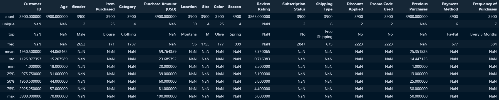
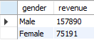
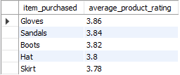
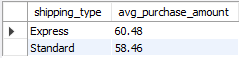
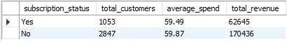
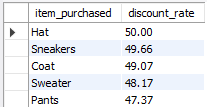
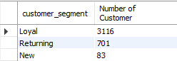
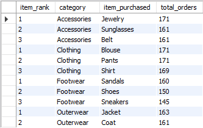
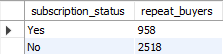
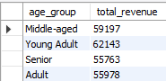

# Customer Shopping Behavior Analysis

## Table of Contents
- [Project Overview](#project-overview)
- [Dataset Summary](#dataset-summary)
- [Exploratory Data Analysis using Python](#exploratory-data-analysis-using-python)
- [Data Analysis using SQL (Business Transactions)](#data-analysis-using-sql-business-transactions)
- [Dashboard in Power BI](#dashboard-in-power-bi)
- [Business Recommendations](#business-recommendations)

## Project Overview 
This project analyzes customer shopping behavior using transactional data from 3,900 purchases across various product categories. The goal is to uncover insights into spending patterns, customer segments, product preferences, and subscription behavior to guide strategic business decisions.
## Dataset Summary
- **Rows**: 3,900 
- **Columns**: 18 
- **Key Features**: 
    - Customer demographics (Age, Gender, Location, Subscription Status) 
    - Purchase details (Item Purchased, Category, Purchase Amount, Season,  Size, Color) 
    - Shopping behavior (Discount Applied, Promo Code Used, Previous Purchases, Frequency of Purchases, Review Rating, Shipping Type) 
    - Missing Data: 37 values in Review Rating column 

## Exploratory Data Analysis using Python
Firstly began with data preparation and cleaning in Python: 
- **Data Loading**: Imported the dataset using pandas. 

- **Initial Exploration**: Used ```df.info()``` to check structure & ```.describe()``` for summary statistics. 



- **Missing Data Handling**: Checked for null values and imputed missing values in the Review Rating column using the median rating of each product category. 

- **Column Standardization**: Renamed columns to snake case for better readability and documentation. 

- **Feature Engineering**: 
    - Created *age_group* column by binning customer ages. 
    
    - Created *purchase_frequency_days* column from purchase data. 

- **Data Consistency Check**: Verified if discount_applied and promo_code_used were redundant; dropped promo_code_used. 

- **Database Integration**: Connected Python script to MySQL and loaded the cleaned DataFrame into the database for SQL analysis. 
    
## Data Analysis using SQL (Business Transactions)
I performed a structured analysis in MySQL to answer key business questions: 
- **Revenue by Gender** – Compared total revenue generated by male vs. female customers. 


 

- **High-Spending Discount Users** – Identified customers who used discounts but still spent above the average purchase amount. (Which customers used a discount but still spent more than the average purchase amount?)

[View the output of SQL Query 2](assets/sql_result_csv_file/4.2.csv)

- **Top 5 Products by Rating** – Found products with the highest average review ratings. (Which are the top 5 products with the highest average review rating?) 
    
    

- **Shipping Type Comparison** – Compared average purchase amounts between Standard and Express shipping. 
    
    

- **Subscribers vs. Non-Subscribers** – Compared average spend and total revenue across subscription status.
    
    

- **Discount-Dependent Products** – Identified 5 products with the highest percentage of discounted purchases.
    
    

- **Customer Segmentation** – Classified customers into New, Returning, and Loyal segments based on purchase history. 

    

- **Top 3 Products per Category** – Listed the most purchased products within each category.
    
    

- **Repeat Buyers & Subscriptions** – Checked whether customers with >5 purchases are more likely to subscribe.
    
    

- **Revenue by Age Group** – Calculated total revenue contribution of each age group. 

    

## Dashboard in Power BI
Finally, we built an interactive dashboard in **PowerBI** to present insights visually.


## Business Recommendations

- The subscription gap is the most actionable finding here. Subscribed customers outspend non-subscribers meaningfully, yet a large chunk of the customer base hasn't converted. The priority should be making the subscription value proposition visible at the right moment that is ideally right after a repeat purchase, when the customer has already demonstrated intent.

- On discounts: several products are seeing the majority of their purchases come through discounted prices, which is a margin problem worth taking seriously. The discount isn't driving discovery for these products but it's become the only reason people buy them. Those specific units need either a pricing review or a deliberate strategy to wean buyers off the discount expectation.

- The age group revenue breakdown is useful for budget allocation. Rather than spreading marketing spend evenly, it makes sense to double down on the segments already generating disproportionate revenue while running cheaper, experimental campaigns toward the lower-contributing groups.

- Repeat buyers are a segment that's already doing the hard work so they just aren't being recognized for it. A simple **loyalty structure** that moves people visibly from "returning" to "loyal" status (with something tangible attached to that label) would likely accelerate subscription conversion among exactly the people most likely to say yes.

- Finally, the top-rated products aren't necessarily the top-selling ones. That gap is free marketing, surfacing genuine high ratings more prominently in product pages or emails costs nothing and converts better than generic promotional copy.